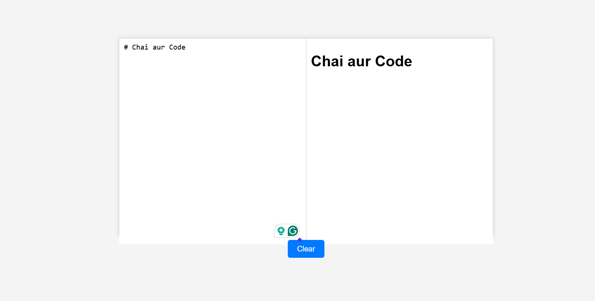

# Markdown Previewer

This is a simple **Markdown Previewer** that allows users to enter Markdown text in a textarea and see the formatted output in real-time. It is built using **HTML, CSS, and JavaScript** with the help of the `marked.js` library for Markdown parsing.

## Features
✅ Live preview of Markdown text
✅ Supports basic Markdown syntax:
   - **Headings** (`# H1`, `## H2`, etc.)
   - **Bold & Italics** (`**bold**`, `_italic_`)
   - **Links** (`[title](http://example.com)`)
   - **Lists** (ordered and unordered)
   - **Code blocks** (inline and multi-line)
✅ Clear button to reset the input field
✅ No backend required—fully runs in the browser!

## How to Use
1. Open `index.html` in your browser.
2. Type Markdown text in the left textarea.
3. See the formatted output on the right in real-time.
4. Click the **Clear** button to erase the text.

## Installation
No installation needed! Just download the files and open `index.html` in any web browser.

## File Structure
```
Markdown-Previewer/
├── index.html  (Main HTML file)
├── style.css   (CSS file for styling)
├── script.js   (JavaScript for functionality)
└── README.md   (This file - Documentation)
```

## Dependencies
- [marked.js](https://github.com/markedjs/marked) (for parsing Markdown)

## Live Demo
[🔗 Live Demo](https://rahul-chahar.github.io/markview-/)


---

## Screen-Shot



----

Made with ❤️

